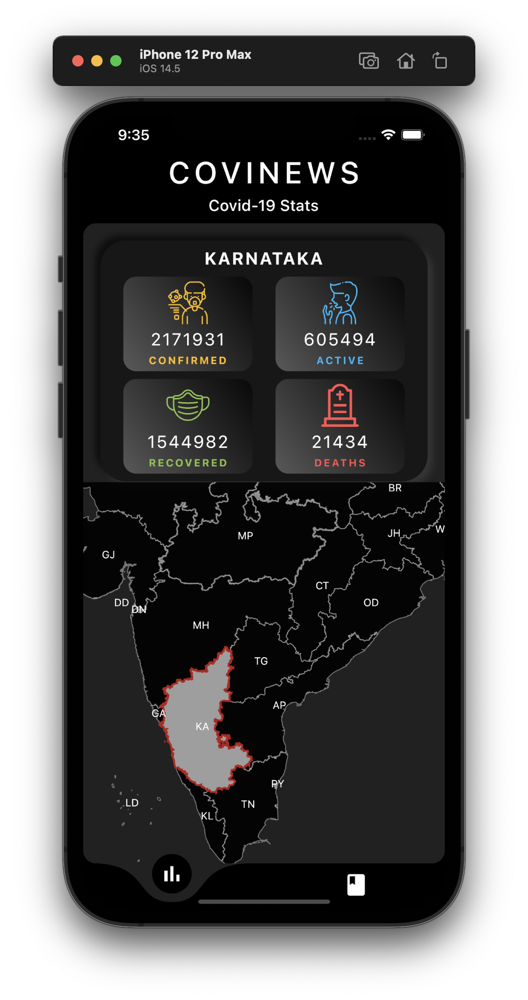
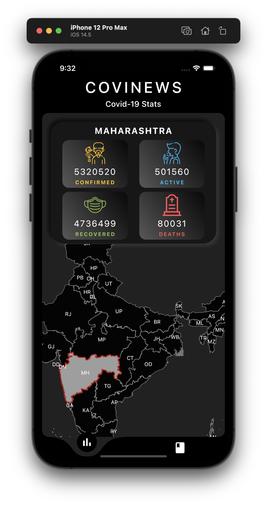
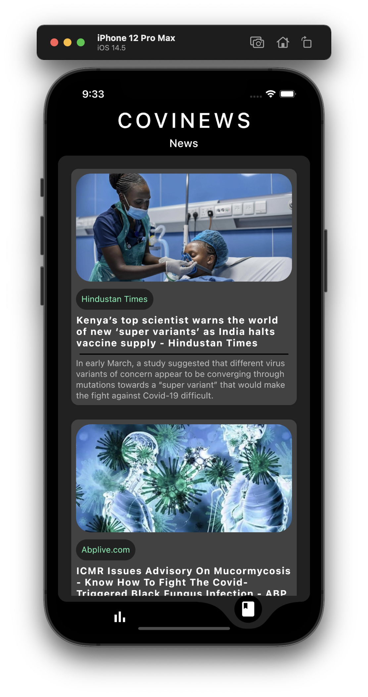

# CoviNews

Flutter application with Covid-19 statistics and News related to health, Covid-19 and vaccine.

## APIs Used - 
- https://api.covid19india.org
- https://newsapi.org

## Screenshots -
   
